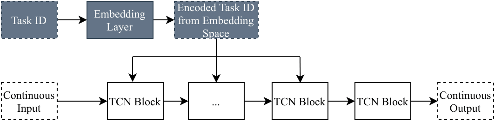
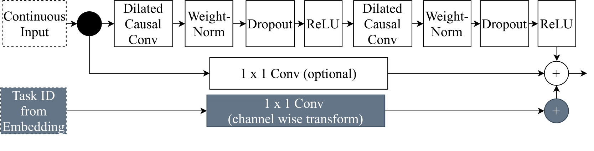
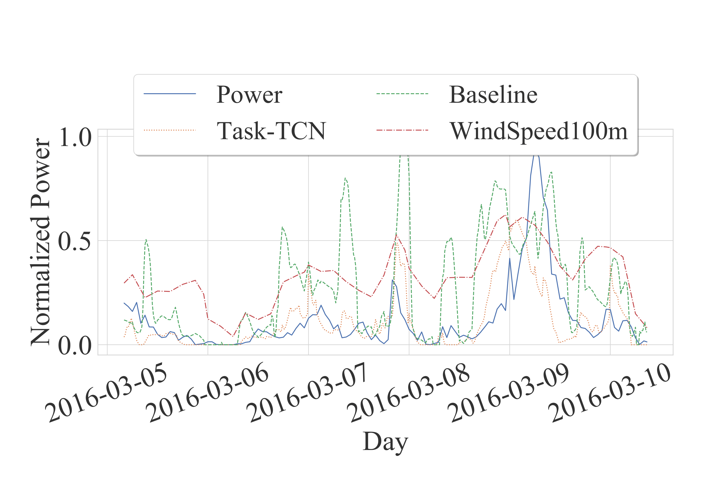
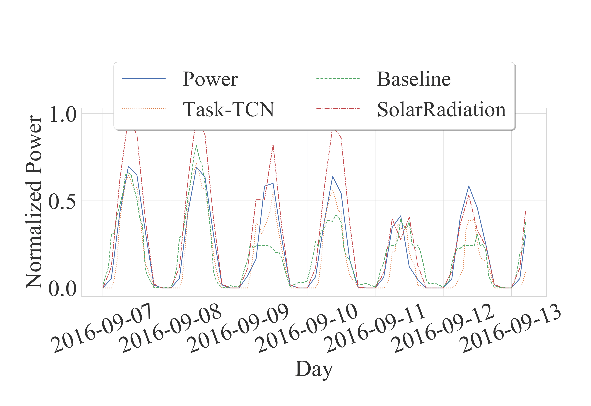

# Task Embedding Temporal Convolution Networks for Transfer Learning Problems in Renewable Power Time-Series Forecast

This repository is the source code for the article `Task Embedding Temporal Convolution Networks for Transfer Learning Problems in Renewable Power Time Series Forecast` accepted at the ECML 2021.
For access to the GermanSolarFarm and the EuropeWindFarm dataset refer to [www.uni-kassel.de/eecs/ies/downloads](www.uni-kassel.de/eecs/ies/downloads).


## Project Structure:

- doc: contains various visalizations
    - It also includes the [supplementary material](https://github.com/scribbler00/task-TCN/blob/main/doc/supplementary%20material.pdf "supplementary material")
- dies: contains the models such as the task embedding mlp and the task-TCN
- rep: is used for preprocessing
- confer/experiments: contains all the scripts to execute the experiment:
    1. `confer/experiments/create_splits.py` creates a cross validation splits of source and target data.
    2. `confer/experiments/source.py` trains on those splits a source model. Can be either mlp or cnn.
    3. `confer/experiments/mtl.py`  executes the mtl experiment   
    4. `confer/experiments/zero_shot.py`  executes the zero shot learning experiment
    5. `confer/experiments/target.py` executes the inductive TL experiment


## Abstract
Task embeddings in multi-layer perceptrons (MLP) for multi-task learning and inductive transfer learning in renewable power forecasts is an exciting new technique. In many cases, this approach improves the forecast error and reduces the required training data. However, it does not take the periodic influences in power forecasts within a day into account, i.e., the diurnal cycle. Therefore, we extended this idea to temporal convolutional networks to consider those in tasks of day-ahead power forecasts for  renewables. We propose transforming the embedding space, which contains the latent similarities between tasks, through convolution and providing these results to the network's residual block. The proposed architecture significantly improves the forecast accuracy up to 25% for multi-task learning for power forecasts on the open EuropeWindFarm and GermanSolarFarm datasets compared to the MLP approach. Based on the same data, we achieve a ten percent improvement for the wind datasets and more than 20\% in most cases for the solar dataset for inductive transfer learning without catastrophic forgetting. Finally, we are the first to propose zero-shot learning for renewable power forecasts. The proposed architecture achieves an error as good as the task embedding MLP with a full year of training data in the respective experiments.

<!-- The Task-temporal convolution network(TCN) encodes a task ID, for each task, through an embedding layer. The learned encoding from the embedding space is *added* in the residual block to provide task-specific forecasts as in the following figure: -->

The task-TCN initially transforms a discrete task ID through an embedding layer. Ideally, in this *embedding space*, similar tasks should be close to one another. This is achieved by a joint training for multiple task.
An overview of the architecture is given in the following figure:





However, in contrast to the task embedding for MLPs, an additional transformation occurs, which results in a *transformed embedding space*. In particular, the embedding space is transformed through a 1D convolution, as given in the following figure. The results of this transformation are added to the output of the residual block. By adding the convolution results, we essentially add a bias to each channel, depending on the relationship between tasks.
 





## Example Plots




## Setup Python environment:

```
projectpath$ sudo apt-get install python3-pip
projectpath$ pip3 install virtualenv
projectpath$ virtualenv tcn
projectpath$ source tcn/bin/activate
projectpath$ pip3 install -r requirements.txt
```
